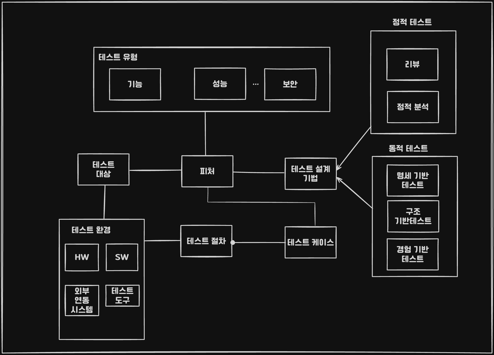

## 테스트 목적

* 결함 검출
* 품질 평가
* 프로세스 개선

## 오류, 결함, 장애

### 오류, 결함, 오작동 차이
* 오류(Error) : 사람에 의해 발생되는 실수
* 결함(Defect) : 에러로 발생한 로직
* 오작동 : 프로그램의 실행 결과와 올바른 결과의 차이 

* 오류의 종류
	* 요구사항 오류
	* 설계 오류
	* 코딩 오류
	* 기타 오류

* 장애 : 요구사항과 다르게 동작하는 것

```
결함은 오류(Error)에 의해 발생되며 장애(Failure)의 원인이 될 수 있습니다.
(오류 -> 결함 -> 장애 순)
```
### 결함 유형

* 누락
* 부적확한 구현
* 비관련 결함
### 개발 단계별 결함

결함 해결 비용 : **유지 보수** > 인수 테스팅 > 단위 테스팅 > 코딩 > 설계 > 요구 분석

```
결함 수정 비용은 운영 및 유지보수 단계에서 비용이 가장 크다
```
### 테스팅, 디버깅, 재테스팅

* 테스팅 : 테스팅은 SW의 실제 동작과 요구사항의 차이를 확인한다.

	```
	테스팅은 정해진 요구사항을 만족하는지 확인하고 주어진 표준을 준수하는지 검증하는 활동
	테스팅은 남아있는 결함이 장애를 일으키지 않음을 증명할 수 없다
	```


## 테스트의 현실 / 실제
### 완벽한 테스트의 비현실성

```
프로그램 결함은 일부분의 모듈에 집중되어 나타난다.
```

### 테스트의 진화 과정

##### Beizer의 소프트웨어 테스트 진화 과정
* 1 레벨 (debugging - oriented)
	* 디버깅 , 개발환경에서의 오류 해결 
* 2 레벨 (demonstration - oriented)
	* 올바른 동작을 입증
* 3 레벨 (destruction - oriented)
	* 오류가 있음을 보여주는 테스트
* 4 레벨 (evaluation - oriented)
	* SDLC(Software Development Life Cycle) 전 단계 오류 테스트
* 5 레벨 (prevention - oriented)
	* 사전에 결함을 예방, 테스트 용이성 고려

### 테스트 원칙

1. 테스트는 반드시 프로그램을 개발한 프로그래머나 팀과 무관한 그룹에 의해서 수행되어야 한다.
2.  테스트 작업 능력이 뛰어난 사람에게 맡겨라 (경험 기반 테스팅)
3.  타당한 경우 뿐 아니라 타당하지 않고, 예상하지 못한 경우 모두 테스트
4.  프로그램 어떤 부분에 오류가 남아있을 확률은 이미 발견된 오류의 수에 직접적으로 비례한다. (파레토 법칙 80:20)
5. 파레토 법칙은 컴퓨팅 자원의 80%를 20%의 모듈이 차지하며, 20%의 모듈이 전체 실행시간의 80%를 차지함, 또한 전체 오류 중 20%가 수정 비용의 80%를 차지함


## 테스트와 품질

### 테스트와 품질 평가

#### 테스트 유형 (ISO 25010)
* 기능 적합성 테스트
* 사용성 테스트
* 신뢰성 테스트
* 호환성 테스트
* 이식성 테스트
* 성능 효율성 테스트
* 보안성 테스트
* 유지 보수성 테스트

### 테스트와 품질 보증

```
품질 보증 > V&V (Verification & Validation) > 테스트
```

## 테스트 기본 용어

### 테스트 대상과 테스트 레벨
* 테스트 대상 : 테스트를 통해 결함을 검출하려는 대상 SW
* 테스트 레벨
	1. 컴포넌트 테스트
	2. 통합 테스트
	3. 시스템 테스트 

### 피처와 테스트 유형
* 피처 : 테스트 대상의 특성 중 테스트하고자 하는 측면, 관점

### 테스트 설계 기법

#### 정적테스팅 (7문제)
*프로그램 실행 전 소스코드 파싱 기반 문법과 코드 등 잠재적 취약점을 발견하는 기법입니다.*

```
정적 테스팅은 개발 초기에 오류를 찾아내어 품질을 향상 시킵니다.
```

##### 리뷰
주 목적은 **결함 발견**입니다. 

##### 정적 분석 공식도
비공식 리뷰 < 워크 쓰루 < 기술리뷰 < 인스펙션

* *비공식 리뷰* - 동료 검토 (Buddy Check) 
* *워크쓰루*(Walkthrough) - 개발 작성물을 작성하는 중에 검토하며 조기에 오류를 발견하고 해결하며 개발 산출물을 작성자에 의해서 진행됩니다. 인스펙션에 비해 비형식적인 기법입니다.
* *인스펙션(Inspection)* - 개발 초기 단계부터 결함을 발견하며, 공식적이고 주재자/검토자/작성자/기록자/판독자/테스터로 구성되며 체크리스트 기반으로 훈련된 리더가 회의를 중재합니다.
* *기술 리뷰* - 체계적으로 명세 및 표준에 대한 적합성 검사

#### 동적테스팅 (17문제)
* 코드의 동적 동작 테스트를 설명하기 위한 것
##### 구조 기반 테스팅 (화이트박스 테스트 종류)
* 프로그램 제어 흐름이나 자료 흐름 정보 이용해 TC 설계하는 방법

| 구분                                  | 개념                                                                                                                                                           |
| ----------------------------------- | ------------------------------------------------------------------------------------------------------------------------------------------------------------ |
| 문장 커버리지 <br>(Statement/Block)       | 모든 문장을 적어도 한번 실행 <br>(테스트케이스에 의해 실행된 문장 수 <br>/ 전체 문장의 수) * 100                                                                                              |
| 분기(결정) 커버리지 <br>(Branch)            | 결정 포인트(If, for, while..)가 참/거짓을 <br>적어도 한번 이상 실행하게 시키는 케이스 <br>(테스트케이스에 의해 실행된 분기 수 <br>/ 전체 분기수) * 100                                                      |
| 조건/분기 커버리지 <br>(Condition/Decision) | 프로그램에 나타난 각 기본조건들의 참과 거짓, <br>및 이를 포함한 각 전체 조건의 참과 거짓이 <br>적어도 한번 테스트 되도록 테스트 케이스를 <br>도출하는 기준 <br>(실행된 기본 + 전체 조건의 T,F 수 <br>/ 모든 기본 + 전체 조건식의 T,F 수) * 100 |
| 다중 조건 커버리지 <br>(Multiple Condition) | 프로그램의 각 조건문 내 기존 조건식의 <br>가능한 논리적 조합이 적어도 한번 테스트 되도록 <br>테스트 케이스를 도출하는 기준 <br>(실행된 기본 조건식의 T,F 수 <br>/ 모든 기본 조건식의 T,F 모든 조합의 개수) * 100                       |
| 기본 경로 커버리지                          | 사이클로매틱 복잡도 계산 <br>1. 간선의 수 - 노드의 수 + 2 <br>2. 폐구간 + 1 3. 분기 노드의 개수 + 2                                                                                       |
##### 명세 기반 테스팅 (블랙 박스 테스트)
*프로그램 내부 논리 참조하지 않고 사용자의 요구 명세나 설계 정보등을 이용해 TC 설계하는 방법*

```
대상 시스템의 명세 정보를 얻을 수 있는 한 테스트 전 과정에 걸쳐 사용될 수 있다
```

| 구분                   | 개념                                                                                                                              |
| -------------------- | ------------------------------------------------------------------------------------------------------------------------------- |
| 동등 클래스 분할            | 클래스 분할하고 대표 값 선택해 테스트 케이스로 사용, <br>동등 입력값에서 오류가 발생하면 다른 값도 오류가 발생한다는 것을 가정                                                      |
| 경계값 분석               | 경계값을 포함시켜서 테스트케이스로 사용                                                                                                           |
| 페어와이즈 조합             | 모든 가능한 조합을 테스트하기 너무 많을 때 모든 짝들의 조합 테스트                                                                                          |
| 상태 전이                | 상태 전이도를 기반으로 입력 데이터를 사용합니다. <br>시스템 현 상황과 이전 이력을 반영하는 상태/변화에 따른 테스트 기법                                                          |
| 인과 그래핑               | 업무의 흐름에 따라 인과관계를 나타내는 그래핑을 하는 테스트 기법                                                                                            |
| 결정 테스트 <br>(도메인 테스트) | 입력 데이터 간 상관관계, 즉 논리적 조건으로 의미가 있을 때 <br>(가입을 해야 주문을 할 수 있다), <br>선정된 입력 데이터에 대한 예상 결과를 포함하는 <br>도메인 테스트 매트릭스 테이블을 생성하여 테스트 하는 기법 |
##### 경험 기반 테스팅
* TC 설계를 바탕으로 테스트를 수행하지 않고 도메인에 대한 테스터의 경험, 기존 테스트 결과, 
  테스터의 직관을 주로 활용해 테스트를 수행하는 방법

| 기법                    | 설명                                                                   |
| --------------------- | -------------------------------------------------------------------- |
| 탐색적 테스트               | 테스트 차트 기반 정해진 시간 내 테스트 설계, 수행 등을 <br>동시에 진행하는 Heuristics Testing 접근법 |
| 오류 추정 기법              | 기능한 결함을 나열하고 결함이나 오류를 <br>추정에 의해 검출 및 수정                             |
| 체크리스트 기법              | 테스트,평가할 내용과 경험을 분류하여 나열해놓은 <br>체크리스트 기반으로 테스트 수행                     |
| 소프트웨어 특성 기반 <br>TC 도출 | 국제 표준 ISO/IEC 9126-2 품질 특성을 기준으로 <br>경험적 테스트 케이스 도출하는 기법             |
| 분류 트리 기법              | 구조로 분석, 표현하고 테스트 케이스를 도출하는 기법                                        |

```
탐색적 테스트는 애자일 방법을 사용하는 웹 응용 시스템에 적합한 방법 
```

### 테스트 케이스

```
테스트 케이스 (Test Case): 입력 + 사전 조건 -> 사후조건 + 예상 출력
```

### 테스트 절차

```
테스트 스크립트(Test Script) 
: 테스트 절차를 문서로 기록하는 대신 자동화 도구가 해석하고 실행하는 언어로 작성한 것
```

### 테스트 환경



