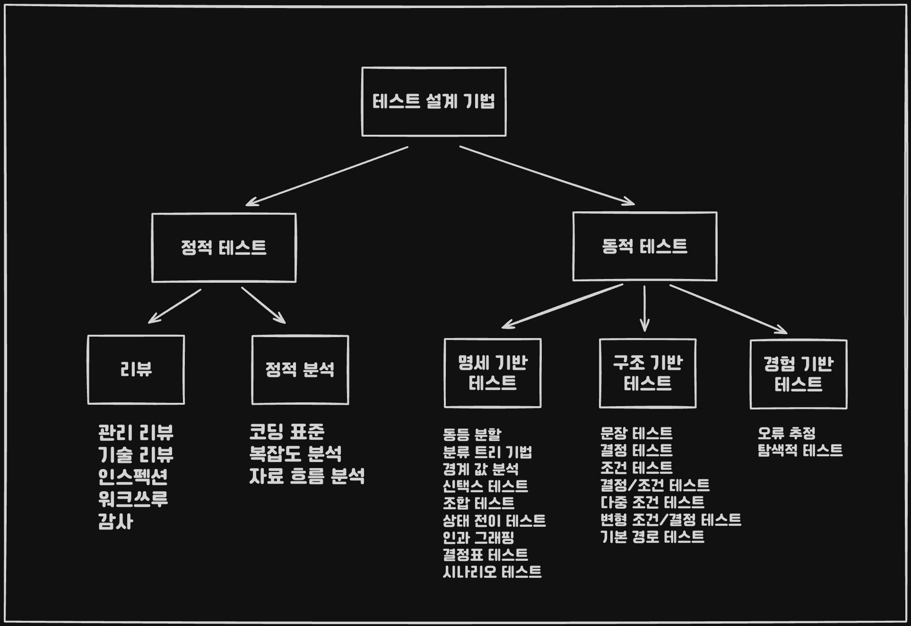

## 개요

* 테스트 분류 : 테스트 레벨(컴포넌트, 통합, 시스템), 테스트 유형(기능, 품질), 테스트 설계 기법
* 테스팅 방법 : 개발 생명 주기, 프로젝트 단계(개발 또는 유지보수) 등 현실적 고려

## 테스트 분류

### 개요

### 테스트 레벨에 의한 분류

1. 컴포넌트 단위 (Unit) 테스트
2. 통합 (Integration) 테스트
3. 시스템 테스트
4. 인수 테스트

### 테스트 유형에 의한 분류

#### 기능 / 비기능 테스트

*기능 : 컴포넌트, 통합, 시스템, 인수 테스트*
*비기능 : 성능, 보안성, 신뢰성 테스트*

```
비기능 테스트는 일반적으로 시스템 / 인수 테스트 수준에서 진행됩니다.
```

#### ISO 25010 품질 모델

### 테스트 설계 기법에 따른 분류



1. 정적 테스트
	1. 리뷰 : 관리 리뷰, 기술 리뷰, 인스펙션, 워크 쓰루, 감사
	2. 정적 분석 : 코딩 표준, 복잡도 측정, 자료 흐름 분석
2. 동적 테스트
	1. 명세 기반 (블랙 박스)
	2. 구조 기반 (화이트 박스)
	3. 경험 기반 : 오류 추정, 탐색적 테스트

## 테스팅 방법

### 리그레션 테스트

*SW 변경 후 수행되는 테스트로 SW에 가해진 변경이 의도하지 않게 결함을 만들지 않았는지 
시스템이 기존의 요구사항을 충족하는지 검증하기 위해 수행된다.* 

* Retest-all 전략
* 선택적 리그레션 테스트 전략
* 테스트 최소화 전략
* 테스트 우선순위화 전략

### SW 생명주기 모델과 테스트

### 위험 기반 테스트

### 모델 기반 테스트

*모델 기반 테스트는 테스트 절차를 수행할 수 있는 정보가 
자동으로 추출될 수 있을 정도로 정형화되고 상세한 모델을 바탕으로 한다.*

```
자연어로 표현된 형식이거나 상태 전이도 또는 UML 다이어그램 같은 
시각적인 표현방식이 될 수 있으며 의사결정표 같은 표 형태도 가능하다.
```

```
테스트 대상의 동작에 대한 정형적 명세를 바탕으로 
테스트 케이스 및 테스트 절차를 자동으로 생성하는 방식으로 수행되는 테스팅
```