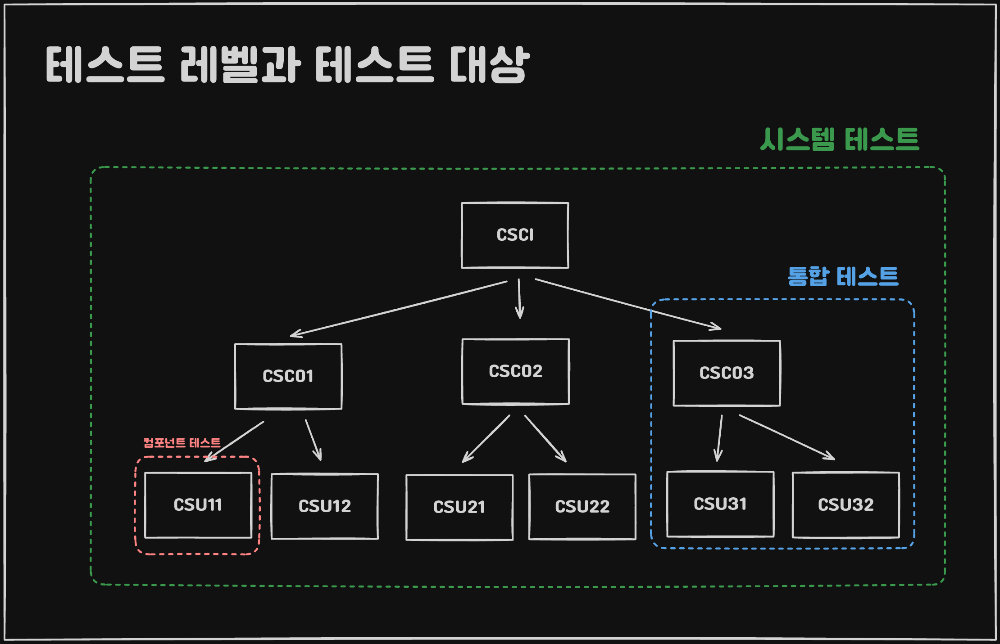

## 개요



## 컴포넌트 테스트

### 모의 객체 생성 프레임워크

### FIRST 원칙

* Fast
* Isolated
* Repeatable
* Self-Validating
* Timely

```
FIRST 원칙은 컴포넌트/단위 테스트를 잘 수행하기 위한 원칙이다.
```
## 통합 테스트

### 점진적 통합

1. 상향식 통합 : 테스트 드라이버
2. 하향식 통합 : 스텁

## 시스템 테스트 및 인수 테스트

1. 알파 테스트
2. 베타 테스트

```
인수 테스트의 수행 주체는 고객 또는 사용자 입니다.
```

## 리그레션 테스트

```
기존의 기능이 제거되면 삭제된 기능을 테스트하는 TC는 제거해야 합니다. (신뢰성 하락 원인)
```

#### APFD (Average Percentage of Faults Detected)

*테스트 케이스의 실행 수 대비 검출된 결함의 비율을 측정합니다.*
