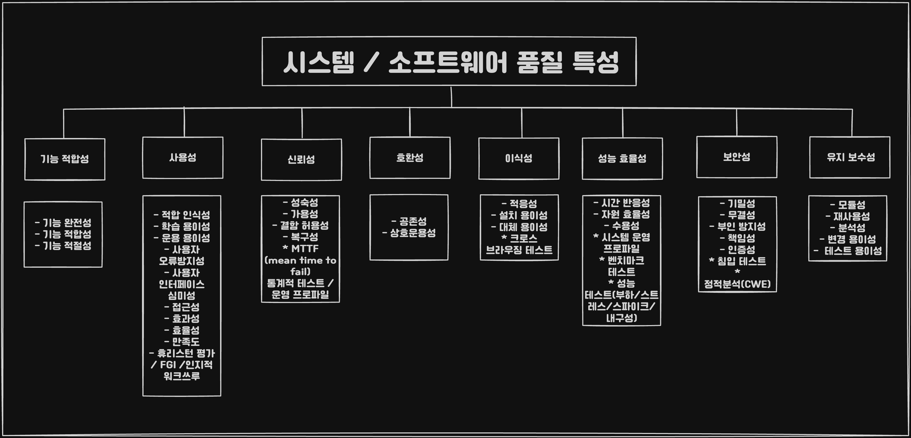
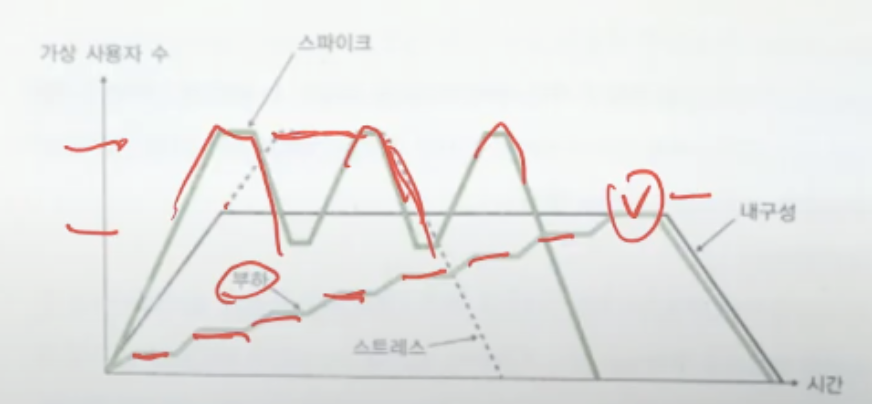

## 개요



## 기능 적합성 테스트

* 기능 완전성
* 기능 정확성
* 기능 적절성

## 성능 효율성 테스트

* 시간 반응성
* 자원 효율성
* 수용성



## 호환성 테스트

* 공존성
* 상호 운용성

```
서로 다른 시스템과의 상호연동능력을 확인하기 위한 테스트입니다.
```

## 사용성 테스트

* 적합 인식성
* 학습 용이성
* 운용 용이성
* 사용자 오류 방지성
* 사용자 인터페이스 심미성
* 접근성

### 사용성 평가를 위한 방법
1. 휴리스틱 평가
2. FGI
3. 인지적 워크 쓰루
4. 설문

## 신뢰성 테스트

* 성숙성
* 가용성
* 결함 허용성
* 복구성

```
특정 조건에서 특정 기간 동안 오동작 없이 의도된 기능을 수행하는 SW 능력입니다.
```

## 보안성 테스트

* 기밀성
* 무결성
* 부인 방지성
* 책임성
* 인증성

## 유지 보수성 테스트

* 모듈성
* 재사용성
* 분석성
* 변경 용이성
* 테스트 용이성

## 이식성 테스트

* 적응성
* 설치 용이성
* 대체 용이성
