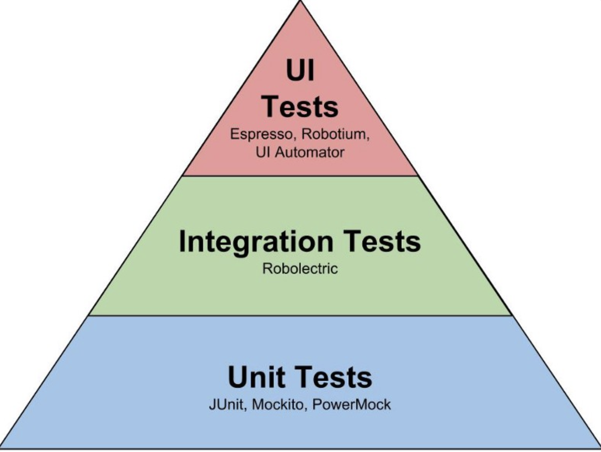

## 개요
### 테스트 설계 도구
1. 테스트 관리
	1. 테스트 계획, 노력 추정, 테스트 일정 관련 작업 수행
	2. 테스트 진행과 보고
	3. 테스트 문서 관리
	4. 요구사항과 TC 추적성 관리
	5. 이슈 등록 및 추적
	6. 변경 관리 및 통제
2. 정적 테스트 
	1. 표준 코딩 규칙 검사
	2. 복잡도 검사
	3. 자료 흐름 검사
3. 동적 테스트
	1. 모델, 소스코드에서 TC 생성
	2. 테스트 실행에 필요한 데이터 자동 생성
4. 테스트 실행 및 로깅
	1. TC 실행
	2. 모의 객체 생성
	3. 기대 결과와 실행 결과 비교
	4. 커버리지 측정
5. 성능 및 모니터링
	1. 메모리 누수 검사
	2. 부하 발생
	3. 성능 측정

## 테스트 자동화 분야 및 테스트 도구

#### SEARCH 모델
1. 셋업 (Set up)
2. 실행 (Execution)
3. 분석 (Analysis)
4. 보고 (Report)
5. 정리 (Clean up)
6. 도움말 (Help)

### 테스트 설계 도구

#### 명세 기반 테스트 설계 도구 (ex. PICT)

#### 구조 기반 테스트 설계 도구 (ex. EvoSuite)

### 테스트 환경 구축 도구

#### IaC (ex. Docker)
*인프라를 코드화/기록 한다.*

### 테스트 실행 도구

1. 선형 (Linear) 프레임 워크
	* 프로그래밍 지식 필요 X, TC 쉽게 작성 가능
	* 유지보수 어려움, 데이터를 사용해 테스트하기 어려움
1. 모듈 (Module) 기반 프레임 워크
	* 프로그래밍 지식 필요 O, 데이터 사용해 테스트하기 어려움 
	* 여러 스크립트에서 공통으로 필요한 스크립트 개발 비용 줄일 수 있음
	* 앱 변경 시 관련 스크립트만 변경 가능, 스크립트 통과 유무로 구분 작성 가능
3. 데이터 주도(Data-Driven) 프레임 워크
	* 프로그래밍 지식 필요 O, 데이터 파일 관리, 검증 요구
	* 다양한 데이터 사용해 테스트, 데이터 파일 관리 용이
5. 키워드 주도(Keyword-Driven) 프레임 워크
	* 테스트 설계와 자동화 분리, TC 유지보수 용이, 키워드 재사용
	* TC 설계 시 프로그래밍 지식 필요 X, 기술적 관점이 아닌 비즈니스 관점 테스트
	* 프레임 워크 구축 시 전문화된 테스트 자동화 인력 요구
	* 테스트 라이브러리를 구성하는 등의 높은 초기 비용

```
키워드란 앱 테스트 시 요구되는 다양한 액션이나 단계를 캡슐화하는 TC 구성 빌딩 블록
```

```
테스트 케이스를 컴퓨터가 실행할 수 있는 스크립트로 변환하는 방법 중 Record & Play 기능
```

### 이슈 관리 도구

* 신규 고객 요구사항
* 가능 개선
* 버그 수정
* 문서 작업
* 시스템 설치 작업

#### 결함 생명  주기
1. 신규 : 테스터를 수행함으로써 결함 식별
2. 진행 : 지시된 결함 해결을 위해 소스 코드 수정
4. 해결  :실제 결함이 해결되었는지 테스트함을 확인
5. 완료 : 결함이 해결된 것을 재테스트를 통해 확인한 상태

## 테스트 도구 선정

### 테스트 피라미드 



### 테스트 도구 선정 프로세스

1. 요구사항 정의
2. 도구 조사
3. 도구 평가
4. 파일럿 프로젝트 <br>
   &rarr; 도구의 시험판 버전을 사용하거나 파일럿 프로젝트를 수행하여 도구의 품질 평가
5. 도구 선정
6. 도구 도입

## 테스트 환경 구축 도구

