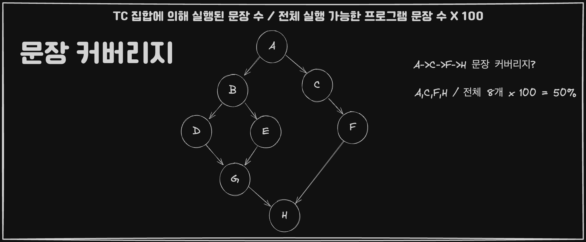
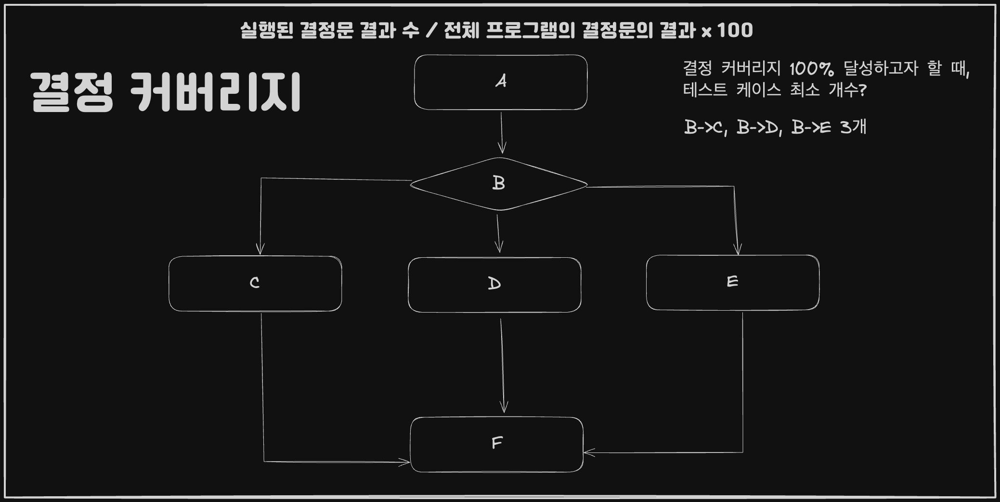
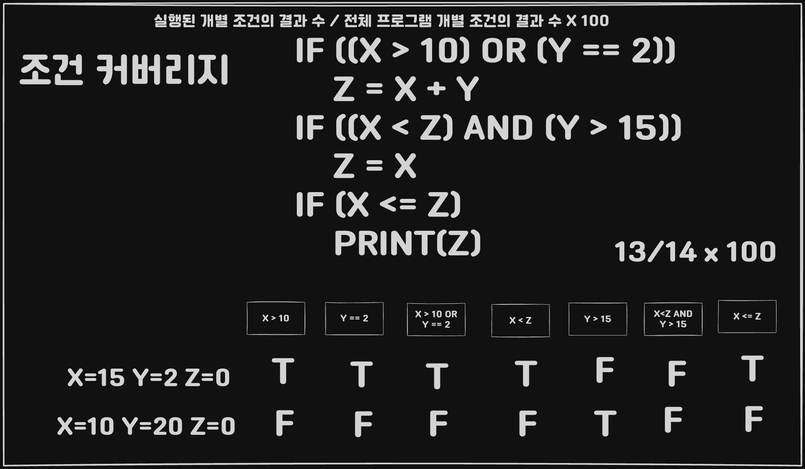

## 개요

**구조 기반 테스트** <br>
= *구조적 테스트 (Structural test)* <br>
= *화이트 박스 테스트 (White box test)* <br>
= *글래스 박스 테스트 (Glass-box test)*

## 제어 흐름 그래프

* 기본 블록
* 제어 흐름

## 구조 기반 테스트의 이해

**프로그램 상에 존재하는 모든 가능한 경로를 테스트하는 대신 
일부 경로만 테스트하는 방법을 사용한다**

## 문장 테스트

*프로그램의 모든 (실행 가능한) 문장을 최소한 한 번은 실행해야 한다*
### 문장 커버리지



{TC 집합에 의해 실행된 문장의 수} / 전체 문장 수 x 100

## 결정 테스트

```
문장 테스트는 더 적은 개수의 테스트 데이터들로 쉽게 만족할 수 있지만
프로그램 상 존재하는 가능한 경우들을 모두 검증하지 못한다는 단점이 있다.
```

*프로그램 상 나타난 모든 결정문의 결과가 참/거짓이 되는 경우를 최소 1번 실행해야 한다*
### 결정 커버리지



{TC 집합에 의해 실행된 결정문 결과 수} / 전체 결정문의 결과 수 x 100

```
결정 테스트는 문장 테스트를 포용한다
```

## 조건 테스트

*프로그램의 조건에 나타난 모든 조건이 참/거짓이 되는 경우 모두를  발생하게 하는
입력 데이터를 테스트 집합으로 사용할 것을 요구합니다*

### 조건 커버리지



{TC 집합에 의해 실행된 개별 조건 결과 수} / 전체 개별 조건의 결과 수 x 100

```
조건 테스트와 결정 테스트는 서로 포용하지 않는다.
```

## 결정 / 조건 (조건 / 분기) 테스트

*결정/조건 테스트를 모두 만족하는 TC 집합을 설계하도록 요구합니다*

### 결정 / 조건 커버리지
{TC 집합에 의해 실행된 결정문과 개별 조건 결과 수} / 전체 결정문,개별 조건의 결과 수 x 100

## 다중 조건 테스트

*결정이 가질 수 있는 경우에 더해 결정을 구성하는 기본 조건들이 가질 수 있는
모든 조합까지도 최소 한 번 검증을 요구합니다*

### 다중 조건 커버리지
{TC 집합에 의해 실행된 조건들의 조합 수} / 전체 개별 조건들의 결과 수 x 100

## 변형된 조건 / 결정 테스트 (MC / DC)

*Modified Condition Decision Adequacy Criterion <br>
조건 테스트와 결정 테스트가 모두 같아야 하지만 
결정을 구성하는 각 조건이 독립적으로 결정의 결과에 영향을 미쳐야 합니다*
### MCDC 커버리지
{TC 집합에 의해 MCDC를 만족하는 조건 수} / 전체 조건들 개수 x 100

```
개별 조건이 독립적으로 변경될 때 전체 결과에 영향을 미치는 케이스 식별
개별 조건 N개의 MC/DC 케이스는 N+1개 필요하다
```

## 기본 경로 테스트

*경로 중에서 기본 경로를 테스트하도록 요구한다
이러한 기본 경로의 개수는 순환 복잡도와 같다*

### 기본 경로 커버리지