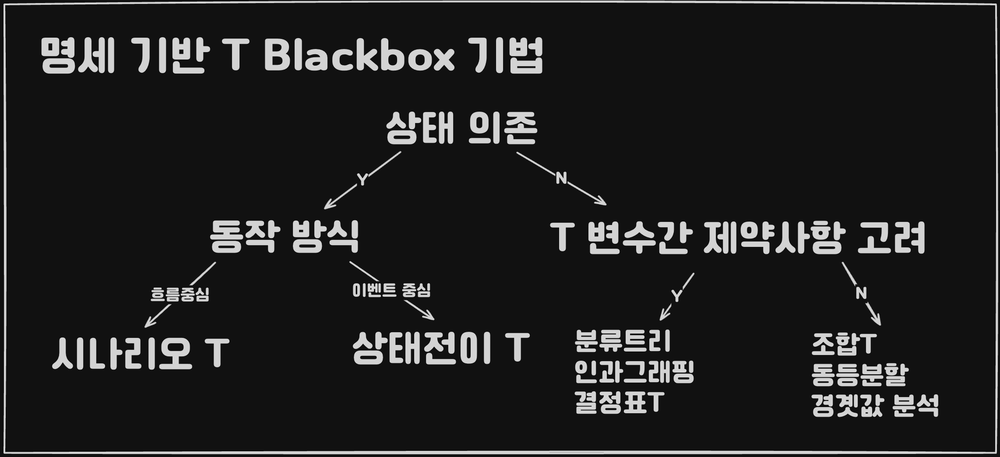

## 개요



**블랙 박스 테스트**

```
적용 대상에 제한이 없으며 컴포넌트, 통합, 시스템 테스트 및 인수 테스트
전 과정에 걸쳐 사용될 수 있다
```

### 장점
1. 서브 시스템이나 전체 시스템 처럼 규모가 큰 단위에도 효과적으로 적용 가능
2. 테스터가 구현 관련 지식이 없어도 테스트 수헹이 가능
3. 사용자 관점에서 테스트를 수행하므로 효과적으로 결함 검출 가능
4. 명세 결함(일관성이나 애매모호한 점)이 드러나는 기회
5. 코드가 구현될 때까지 기다릴 필요가 없음
6. *누락 결함(명세에는 있지만 구현되지 않은 기능)* 을 검출할 가능성을 높여줌

## 동등 분할

**입, 출력 영역을 동등 클래스라 불리는 몇 개 영역으로 분할하여 
각 클래스에서 하나의 값을 선택하여 TC로 이용합니다**

### One to One 동등 분할
입/출력 영역을 분할한 클래스들과 TC 간 1대1 관계를 명시적으로 보여줍니다
### 최소화 동등 분할
하나의 TC에 여러 개의 분할된 클래스가 포함되도록 합니다

```
유효하지 못한 TC는 One to One 방식으로 설계하고,
유효한 TC는 최소화 동등 분할 방식을 이용하여 TC를 설계하는 것도 고려할 만 하다
```

## 분류 트리 기법

## 경곗값 분석

## 조합 테스트

### Each choice 테스트
각 입력 인자의 분할된 클래스에서 최소한 하나의 입력값이 TC에 포함되도록 합니다

### 페어와이즈  테스트
입력들의 모든 가능한 조합들을 테스트하는 대신
모든 입력 값의 모든 짝 조합을 테스트 하는 방법입니다
즉, 모든 입력에 대해 존재할 수 있는 모든 상호작용을 고려하지 않고
모든 두 개의 입력 간에 가능한 모든 상호작용만을 고려한다

### All combination 테스트

### Best choice 테스트


## 결정표 테스트

**결정표를 이용하여 TC를 설계하는 테스트 방법**

* 입력 조건의 모든 조합에 대한 *시스템의 행동*을 고려하여 TC를 도출하는 기법
* 복잡한 논리적 관계를 표현하기 좋은 기법
* 누락된 요구사항이 있는지 검사하기 좋은 기법

```
시나리오, 상태 전이 테스팅은 상태 의존적인 동작을 하는 경우에 적합하다.
하지만 결정표 테스팅은 그렇지 않다.
```

## 상태 전이 테스트

**시스템을 상태 전이도로 모델링한 후 TC들을 상태 전이도에서 체계적으로 선정하는 방법**

### 상태 테스트
상태 전이도의 *모든 상태*를 최소 한 번 방문하는 TC들을 설계한다.

### 단일 전이 테스트 ( 0 - switch 테스트 )
상태 전이도의 모든 *유효한 전이들* 을 최소한 한 번 방문하는 TC들을 설계한다.
### All transitions 테스트
*유효한 전이들* 을 포함하여 *유효하지 않은 전이들* 도 최소한 한 번 방문하는 TC들을 설계한다.
> 유효하지 않은 경우? 상태 전이도의 각 상태에서 명시되어 있지 않은 이벤트가 왔을 때

### 다중 전이 테스트 ( N - switch 테스트 )
상태 전이도에 있는 *N+1 개의 전이 시퀀스들* 을 최소한 한 번 방문하는 TC들을 설계한다.


## 시나리오 테스트

**기존 요구사항 명세서에서 각 개별 기능에 대한 상세 내용이 시나리오 형태로 기술되어 있다면 <br>
이를 이용해서 기능 테스트를 수행할 수 있습니다**