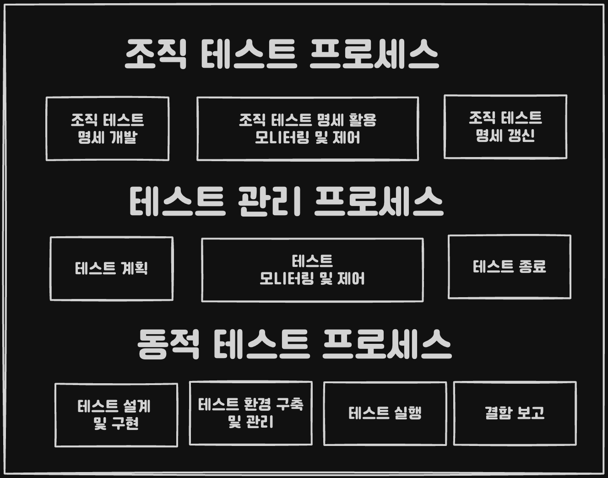
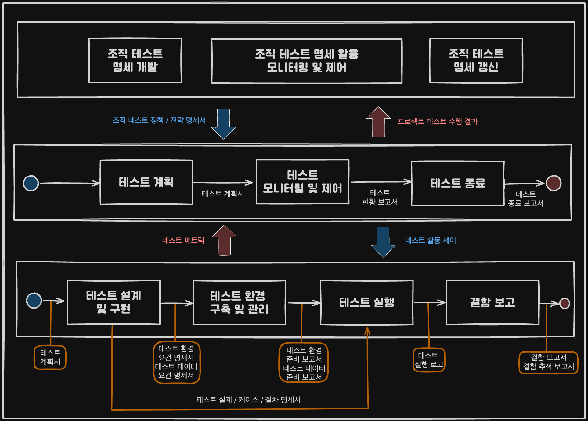
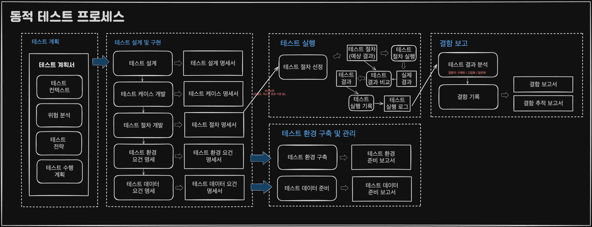

## 개요

**테스트에 소요된 비용과 테스트를 통해 성취한 SW 품질 개선 정도를 측정하여<br> 
수행된 활동이 얼마나 효과적이고 효율적인지 평가해야 합니다**

### 테스트 프로세스 필요성

* SW 품질 목표 달성에 프로세스가 중요한 역할
* 효율적이고 효과적인 테스트 수행을 위한 관리의 중요성이 부각
* 평가를 통한 테스트 활동 개선이 필요

```
프로젝트 제약 3요소는 예산, 시간, 품질이므로 항상 개발 시간이 충분하지 못합니다. 
따라서 주어진 시간 내 체계적인 테스트를 수행해야 합니다.
```

### 테스트 프로세스 개요



1. 조직 테스트 프로세스
	1. 조직 테스트 명세 개발
	2. 조직 테스트 명세 활용 모니터링 및 제어
	3. 조직 테스트 명세 갱신
2. 테스트 관리 프로세스
	1. 테스트 계획
	2. 테스트 모니터링 및 제어
	3. 테스트 종료
3. 동적 테스트 프로세스
	1. 테스트 설계 및 구현
	2. 테스트 환경 구축 및 관리
	3. 테스트 실행
	4. 결함 보고

## 조직 테스트 프로세스

### 개요
**특정 테스트 프로젝트 수준이 아니라 
조직 전체에서 수행될 모든 테스트 프로젝트의 공통 사항을 정의하는데 초점을 둔다**

```
조직 테스트 정책 명세서는 최상위 수준의 명세로서 
조직 차원의 테스트 목적과 원칙을 정의하며 테스트를 수행하는 구체적 방법은 언급하지 않는다.
```

### 조직 테스트 프로세스 활동

#### 조직 테스트 명세 개발
##### 프로젝트 수준
컴포넌트, 통합, 시스템, 인수 등 특정 레벨 테스트와 
성능, 신뢰성, 보안 등 특정한 유형 테스트에 국한되지 않는 <br>
여러 개별 테스트에 공통적으로 적용될 수 있는 항목을 적용합니다

```
위험 관리, 테스트 선택 및 우선순위, 테스트 문서화, 형상 관리, 결함 관리, 자동화 도구 등..
```
##### 개별 테스트 수준
프로젝트 테스트를 구성하는 각각의 구체적인 테스트에 적용하는 전략을 의미합니다

```
테스트 시작 및 종료 조건을 포함하여 테스트 독립성 / 문서화 / 설계 기법 / 
테스트 환경 및 테스트 데이터 / 재테스팅 및 리그레션 테스팅, 테스트 메트릭, 테스트 완료 기준
```

#### 조직 테스트 명세 활용 모니터링 및 제어
개발된 조직 테스트 명세서는 실제 수행되는 테스트 프로세스에서 활용하며, <br>
해당 테스트 프로세스 수행의 기본 지침으로써 사용됩니다

```
테스트 관리 프로세스 및 동적 테스트 프로세스는
조직 테스트 명세서의 내용을 바탕으로 수행되어야 합니다
```

#### 조직 테스트 명세 갱신
전체 테스트에 대한 공통적인 지침인 만큼 효과적이고 효율적인 테스트 수행을 위해 <br>
조직 테스트 명세서를 지속적으로 갱신해야 합니다

### 조직 테스트 정책
1. 테스트 목적
2. 테스트 프로세스
3. 테스트 조직 및 역할
4. 테스트 표준
	1. 테스트 관련 기본 표준
		1. 테스트 관리 : ISO/IEC/IEEE 29919 
		2. 동적 테스트 : ISO/IEC/IEEE 29919
		3. 정적 테스트 : IEEE std. 1028 , ISO/IEC 20246
		4. 테스트 프로세스 평가 : ISO/IEC 33063: 2015
	2. 도메인 별 테스트 관련 표준
		1. 자동차 : ISO 26262-6
		2. 항공기 : DO-178C
		3. 철도 : IEC 62279
	3. 그 외 관련 표준
		1. 품질 모델 : ISO/IEC 25010
		2. 품질 측정 : ISO/IEC 25023
		3. 품질 보증 : IEEE Std. 730, 1012
		4. 위험 관리 : ISO/IEC 16085
		5. 형상 관리 : ISO 10007
		6. 결함 관리 : IEEE Std. 1044, ISO/IEC 20000 
5. 테스트 자산 관리
6. 테스트 프로세스 개선

### 프로젝트 수준의 조직 테스트 전략

#### 1. 위험 관리
##### 위험 분석
1. 위험 요소 식별
2. 위험도 산정 : 발생 가능성과 영향도를 통해서 산정
	1. 과거 사례 분석
	2. 폴트 / 이벤트 트리 분석 등의 예측 방법
	3. 체계적인 전문가 의견
3. 위험 평가
##### 위험 조치
1. 위험 회피
2. 위험 완화 : 위험 발생 가능성을 낮추거나 발생에 따른 영향도를 축소시키는 방안 수립
3. 위험 전가 : 위험에 해당하는 기능 및 비기능 피처에 대한 테스팅을 아웃소싱하는 방안
4. 위험 수용 : 상황에 따라서 위험에 대한 특별한 조치 없이 모니터링 하는 방안
5. **비상 계획** : 위험 회피/완화/전가 조치 불가능 또는 실패하여 위험 요소 발생했을 경우 취할 조치

##### 위험 모니터링

#### 2. 테스트 선택 및 우선순위

#### 3. 테스트 문서화

#### 4. 형상 관리

#### 5. 결함 관리

#### 6. 자동화 도구

#### 7. 수행 개별 테스트

### 개별 테스트 수준의 조직 테스트 전략

#### 1. 테스트 독립성

#### 2. 테스트 문서화

#### 3. 테스트 시작 및 종료 조건

##### 테스트 활동의 시작 및 종료 조건

##### 개별 테스트 프로세스의 시작 및 종료 조건

#### 4. 테스트 설계 기법

#### 5. 테스트 환경 및 테스트 데이터

#### 6. 재테스팅 및 리그레션 테스팅

#### 7. 테스트 메트릭

#### 8. 테스트 완료 기준

### 산출물 요약

## 테스트 관리 프로세스



**프로젝트 테스트 및 프로젝트 테스트를 구성하는 
레벨 테스트와 유형 테스트의 수행을 관리가 목적**

### 테스트 활동

#### 1. 테스트 계획
테스트 대상과 범위 식별하고 조직 테스트 프로세스를 참고하여 테스트 전략을 수립한다

```
테스트 계획에서 정의된 테스트 대상과 테스트 범위를 확장한다?
테스트 대상과 범위는 계획에서 결정된다. 
동적 테스트 프로세스에서는 범위를 세분화하고 전략을 구체화 한다.
```

#### 2. 테스트 모니터링 및 제어
동적 테스트 프로세스의 수행을 모니터링하여 테스트 현황 파악하고 테스트 활동을 적절히 제어한다

#### 3. 테스트 종료
테스트가 종료되면 생성된 산출물을 관리하고 테스트 환경을 정리하며 테스트 종료 보고를 한다

## 동적 테스트 프로세스



**테스트 계획에서 정의된 테스트 대상, 테스트 범위 그리고 테스트 전략을 바탕으로 수행된다**

### 테스트 활동

#### 1. 테스트 설계 및 구현
테스트 계획에서 식별된 테스트 범위와 테스트 전략에 따라 TC, 테스트 절차 등을 개발

#### 2. 테스트 환경 구축 및 관리
테스트 실행을 위한 테스트 환경과 테스트 데이터를 준비

#### 3. 테스트 실행
테스트 절차를 실행하고 테스트 실행 결과를 기록

#### 4. 결함 보고
테스트 실행 결과에 대한 분석을 바탕으로 결함을 식별하고 기록

### 산출물 요약

## 테스트 산출물

### 산출물 요약

### 산출물 간의 관계


