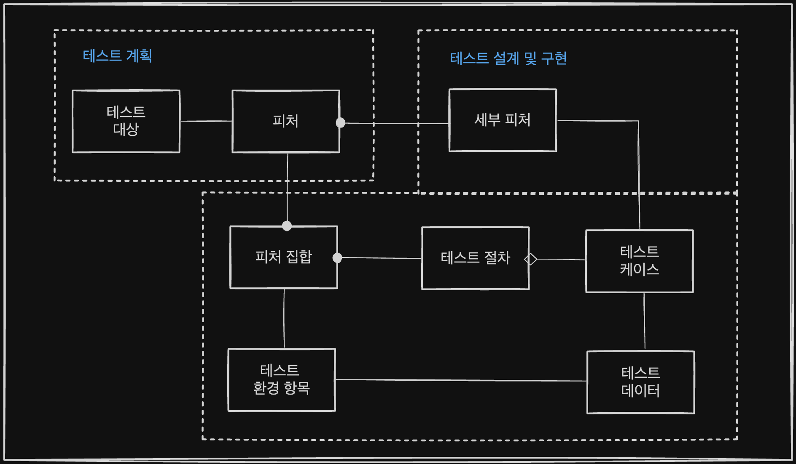

## 개요

### 테스트 설계 및 구현 개념



테스트 범위/ 전략을 구체화하며 이를 바탕으로 TC 및 테스트 절차를 개발

### 테스트 환경 구축 및 관리
테스트 설계 및 구현 활동에서 정의된 테스트 환경 / 데이터 요건 따라 준비

## 테스트 설계 및 구현

### 개요

* 테스트 계획서에서는 테스트 대상에 대한 테스트 범위를 피처로 정의
* 피처 집합을 구성하는 각 세부 피처에 대하여 TC 개발
  일반적으로 하나의 세부 피처에 대해 복수 개의 TC가 개발됨
 * 테스트 절차 실행을 위해서 테스트 대상이 의존하는 테스트 환경 구축 필요
 * 테스트 케이스 실행 위해 테스트 환경과 더불어 테스트 데이터가 필요
### 테스트 설계

### 테스트 케이스 개발

### 테스트 절차 개발

### 테스트 환경 요건 명세

### 테스트 데이터 요건 명세

## 테스트 환경 구축 및 관리

### 개요

* 테스트 환경 구축 :테스트 환경 요건 명세서에 명시된 각 테스트 환경 항목 구축
* 테스트 데이터 준비 : 테스트 데이터 요건 명세서에 명시된 테스트 데이터를 준비

```
테스트 환경 요건 명세서에 기재되는 내용?
- 활용 목적, 필요 시기, 담당자 
```
### 테스트 데이터 준비
### 테스트 환경 구축 및 관리

## 산출물 요약

#### 테스트 설계 명세서

#### 테스트 케이스 명세서
주요 항목 - 목적, 추적성, 우선 순위, 선행 조건, 입력, 예상 결과
#### 테스트 절차 명세서

#### 테스트 환경 요건 명세서
주요 항목 : 테스트 환경 항목명, 설명, 요구사항, 필요 시기, 담당자
#### 테스트 데이터 요건 명세서

#### 테스트 환경 준비 보고서

#### 테스트 데이터 준비 보고서

<br>

```
1. 테스트 설계 명세서를 바탕으로 테스트 케이스 및 테스트 절차를 정의
2. 테스트 절차서에는 테스트 케이스를 실행시키는 절차를 정의
3. 테스트 케이스 명세서에는 구체적인 테스트 접근 방법과 테스트 통과 기준 기록
```


