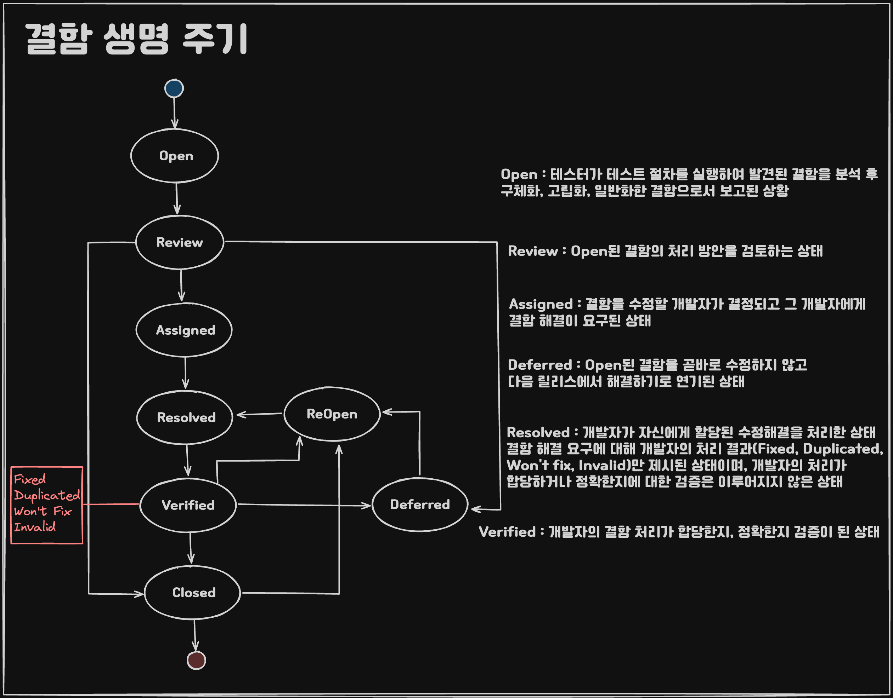

## 개요

* 테스트 실행 : 주어진 테스트 절차 중 실행하고자 하는 테스트 절차를 선정
* 결함 보고 : 테스트 실행 로그를 바탕으로 테스트 결과를 분석하여 결함을 식별

## 테스트 실행

### 개요

**태스트 설계 및 구현 활동에서 개발된 테스트 절차를 실행함**

테스트 실행 로그 주요 항목 - 설명, 테스트 작업과 이벤트 목록

### 테스트 절차 선정
#### 1. 우선순위 전략
* 피처 집합 우선 순위
* 테스트 케이스 우선 순위
* 테스트 절차 우선순위

#### 2. 테스트 완료 기준 전략

```
효율적으로 테스트 실행 활동을 수행하기 위해서 적절한 기준으로 실행할 테스트 절차를 선택해야 함
테스트 완료 기준 달성에 가장 크게 기여할 수 있는 테스트 절차를 먼저 실행시키는 것이 바람직함
```

### 테스트 절차 실행

#### 테스트 실행 주체

| 테스트 레벨   | 개발자 | 테스터 | 사용자 |
| -------- | :-: | :-: | :-: |
| 컴포넌트 테스트 |  O  |  O  |     |
| 통합 테스트   |  O  |  O  |     |
| 시스템 테스트  |  O  |  O  |  O  |
| 인수 테스트   |     |  O  |  O  |

```
시스템 테스트가 테스터가 주도적으로 중요한 역할을 하는 테스트임 (명세 기반 테스트 기법)
```

### 테스트 결과 비교

### 테스트 실행 기록

## 결함 보고

### 테스트 결과 분석

#### 결함의 구체화
테스트 데이터, 테스트 절차, 테스트 환경을 구체화 함으로써 
발견된 결함 재연할 수 있는 충분하고 명확한 상황을 파악해야 함
#### 결함의 고립화
결함 발생의 구체적인 상황을 파악하기 위해서는 
결함 발생에 영향을 미치는 것으로 추정되는 중요 요소를 바꿔가면서 테스트를 수행함
#### 결함의 일반화
결함 발생에 영향을 주는 요소를 최대한 일반적으로 기술하는 것이 바람직 함

### 결함 기록
1. 결함 컨텍스트 : 어떤 상황에서 결함 식별되었는지 기술
2. 결함 설명 : 목격된 결함 재연되고 해결될 수 있도록 상세히 기술
3. 심각도 : 발견자 관점에서 기술적/비즈니스적 측면 모두 고려해 미치는 영향 범위, 크기 기술
4. 우선순위 : 검출된 결함 해결의 긴급성을 기술 (ex. 즉시 해결, 다음 릴리스에서 해결 등)
5. 위험 분석 : 검출된 결함과 관련된 새로운 위험에 대한 분석 결과를 기술
6. 결함 상태 : 검출된 결함에 대한 조치 상태를 기술 (결함 생명 주기)

### 결함 추적

#### 결함 생명 주기



1. Open : 테스터가 테스트 절차를 실행, 발견한 결함 분석 후 구체화/고립화/일반화 한 결함 보고

2. Review : "Open"된 결함의 처리 방안 검토하는 상태
3. Deferred : "Open"된 결함을 다음 릴리스에서 해결하기로 연기된 상태
4. Assigned : 결함을 수정할 개발자가 결정되고 그 개발자에게 결함 해결을 요구한 상태
5. Resolved : 결함 해결 요구에 대해 개발자의 처리 결과(아래 4가지)만 제시된 상태
6. Verified : 개발자의 결함 처리가 합당한지, 정확한지 검증이 된 상태
	1. Fixed : 재 테스팅을 수행 -> 정확한 수정? Closed 아니다? Reopen
	2. Duplicated : 동일한 이전 결함이 적절히 처리되었는지 검증 
	3. Won't Fix : 실제로 해당 결함이 중요하지 않거나 긴급하지 않은지 확인
	4. Invalid : 결함 보고 자체에 문제가 있는지 검증
7. Closed

<br>

| Verified 이후 |    정확    | 부정확 |
|:-------------:|:----------:|:------:|
|     Fixed     |   Closed   | Reopen |
|  Duplicated   |   Closed   | Reopen |
|   Won't Fix   | **Deferred** | Reopen |
|    Invalid    |   Closed   | Reopen |

#### 결함 처리 시나리오

#### 경미한 결함의 무시 시나리오

*Open - Review - Closed*

#### 차후에 결함을 처리하는 경우

*Open - Review - Deferred ~ Reopen - Assigned - Resolved - Verified ~*

#### 이번 릴리스에서 결함을 처리하는 경우

*Open - Review - Assigned ~ Resolved - Verified ~*

#### 결함 추적 보고서

## 산출물 요약

### 결함 보고서

* 결함 컨텍스트
* 결함 설명
* 심각도
* 우선 순위
* 위험 분석
* 결함 상태

### 결함 보고 산출물

* 결함 검토 정보
* 결함 해결 정보
* 결함 해결 검증 정보