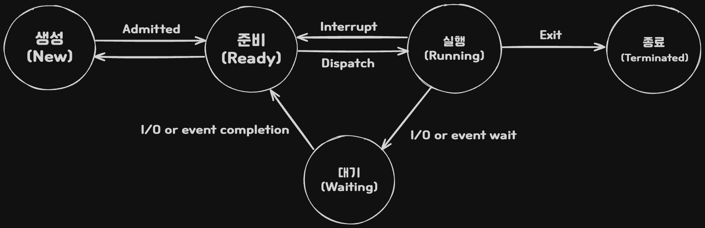

# 응용 SW 기초 기술 활용

## 운영 체제 기초 활용

### 교체 기법 알고리즘
|             세부 기법              | 설명 |
|:----------------------------------:|:----:|
|    FIFO<br>(First In First Out)    | 각 페이지가 주 기억장치에 적재될 때마다<br>그때의 시간을 기억시켜 가장 먼저 들어와 <br>가장 오래 있던 페이지를 교체하는 기법(선입선출)     |
|    LRU<br>(Least Recently Used)    |      |
|    LFU<br>(OPTimal Replacement)    |      |
|     NUR<br>(Not Used Recently)     |      |
| SCR<br>(Second Chance Replacement) |      |

### 페이징 기법의 문제점 - 스레싱(Thrashing)
* 스레싱은 어떤 프로세스가 계속적으로 페이지 부재가 발생하여 
	  **프로세스의 실제 처리 시간보다 페이지 교체 시간이 더 많아지는 현상이다.**
* 페이지 부재가 계속 증가하여 기억장치 접근 시간이 증가한다.

### 페이징 기법의 문제점 해결방안
* 워킹 세트 (Working Set) : 각 프로세스가 많이 참조하는 페이지들의 집합을 주 기억장치 공간에 계속 상주하게 하여 빈번한 페이지 교체 현상을 줄이고자 하는 기법이다.

|                                        장점                                        | 단점 |
|:----------------------------------------------------------------------------------:|:----:|
| 멀티프로그래밍 정도를 높일 수 있고 (Page Hit 증가)<br>CPU 활용률 최적화 할 수 있음 | 워킹세트 추적관리가 복잡하고, <br>워킹 세트 크기 설정의 모호함이 발생     |

* 페이지 부재 빈도(PFF; Page-Fault Frequency) : 페이지 부재 빈도는 페이지 부재율의 상한과 하한을 정해 **직접적으로 페이지 부재율을 예측하고 조절**하는 기법이다.

|                                           장점                                           | 단점 |
|:----------------------------------------------------------------------------------------:|:----:|
| 페이지 부재 발생 시 실행하여 부하가 적고 <br>직접적으로 페이지 부재율 조절이 가능한 기법 | 프로세스를 중지시키는 과정이 발생하고, <br>페이지 참조가 새로운 지역성으로 이동할 수 있음     |

### 지역성(Locality)
지역성(국부성, 구역성, 국소성)은 프로세스가 실행되는 동안 주기억장치를 참조할 때 일부 페이지만 집중적으로 참조하는 특성
> 시공순

| 유형 | 설명 | 사례 |
| :--: | :--: | :--: |
| <br>시간(Temporal)<br>지역성 | 최근 사용되었던 기억장소들이<br>집중적으로 액세스하는 현상<br>참조했던 메모리는 빠른시간에<br>다시 참조될 확률이 높은 특성 | Loop(반복,순환)<br>Stack(스택)<br>Sub Routine(부 프로그램)<br>Totaling(집계) |
| <br>공간(Spatial)<br>지역성 | <br>프로세스 실행 시 일정 위치의<br>페이지를 집중적으로 액세스하는 현상<br>참조된 메모리 근처의 메모리를 참조하는 특성 | 배열 순회<br>프로그래머들이 관련된 변수<br>서로 근처에 선언하여 <br>할당되는 기억장소<br>같은 영역에 있는 변수 참조 |
| 순차(Sequential)<br>지역성 | 데이터가 순차적으로 액세스 되는 현상<br>프로그램 내 명령어가 순차적으로 구성된 특성<br>공간 지역성에 편입되어 설명되기도 함 | <br>순차적 코드 실행 |

### 프로세스 상태 전이



| 프로세스 상태 전이 | 설명 |
| ---- | ---- |
| 디스패치<br>(Dispatch) | 준비 상태 있는 여러 프로세스(Ready List) 중 실행될 프로세스를 선정<br>(Scheduling)하여 CPU를 할당 (Dispatching) -> 문맥 교환 발생<br>프로세스는 준비 상태에서 실행 상태로 전이 |
| 할당 시간 초과 | CPU를 할당받은 프로세스는 지정된 시간이 초과되면 스케줄러에 의해<br>PCB 저장, CPU 반납 후 다시 준비 상태로 전이됨<br>프로세스는 실행 상태에서 준비상태로 전이<br>타임 슬라이스(Time Slice) 만료, 선점(Preemption) 시 타임 아웃 발생 |
| 입출력 발생 | 실행 상태에 있는 프로세스가 지정된 할당 시간을 초과하기 전에 <br>입출력이나 기타 사건 발생(Block)하면 CPU를 스스로 반납하고<br>입출력이 완료될 때까지 대기 상태로 전이<br>즉시 실행 불가능한 시스템 콜, I/O 작업 시작, 프로세스 간 통신 시 Block |
| 깨움 | 어느 순간에 입출력이 종료되면 대기 상태의 프로세스에게 입출력 종료<br>사실을 Wait & Signal 등에 알려주고 준비상태로 전이 |

### 선점형 스케줄링 알고리즘
> SMMR (Show Me the Money 다음 Round 진출)

|                       알고리즘 유형                       |                                                                             동작방식                                                                              |                    특징                    |
|:---------------------------------------------------------:|:-----------------------------------------------------------------------------------------------------------------------------------------------------------------:|:------------------------------------------:|
|               라운드 로빈<br>(Round Robin)                | 프로세스는 같은 크기의 CPU 시간 할당<br>프로세스가 **할당된 시간 내** 처리 완료 못하면<br>준비 큐 리스트 가장 뒤로 보내지고 CPU는<br>대기 중인 다음 프로세스로 넘어감 | <br>균등한 CPU 점유 시간<br>시분할 시스템 사용 |
|        SRT<br>(Shortest Remaining <br>Time First)         | 가장 짧은 시간이 소요되는 프로세스 먼저 수행<br>남은 처리 시간이 짧다고 판단되는 프로세스가<br>준비 큐에 생기면 언제든 프로세스 선점됨                                                                                                                                                                  | 짧은 수행시간<br>프로세스 우선 수행                                           |
|         다단계 큐<br>(MLQ; Multi Level <br>Queue)         |                                                                                                                                                                   |                                            |
| 다단계 피드백 큐<br>(MFQ; Multi Level <br>Feedback Queue) |                                                                                                                                                                   |                                            |

### 비선점형 스케줄링 알고리즘
> 우기 HFS (우리 기업은 홈 패밀리 서비스(HFS)를 제공한다)

| 알고리즘 유형 |                             동작방식                              | 특징 |
|:-------------:|:-----------------------------------------------------------------:|:----:|
|   <br>우선순위<br>(Priority)    | 각 프로세스 별 우선순위가 주어지고,<br>우선순위에 따라 CPU 할당함<br>동일 순위는 FCFS | 주요/긴급 프로세스<br>우선 처리<br>설정/자원 상황 등에<br>다른 우선순위 선정      |
|    기한부<br>(Deadline)     | 작업들이 명시된 시간이나 기한 내에<br>완료되도록 계획                                                                  | 요청에 명시된 시간 내<br>처리를 보장     |
|     FCFS<br>(First Come<br>First Served)      | 프로세스가 대기 큐에 도착한 순서 따라<br>CPU를 할당함 (FIFO 알고리즘)                                                                  | 도착한 순서대로<br>처리     |
|      <br><br>SJF<br>(Shortest<br>Job First)      | 프로세스가 도착하는 시점 따라 그 당시 <br>**가장 작은 서비스 시간**을 갖는 프로세스가 <br>종료 시까지 자원 점유<br>준비 큐 작업 중 가장 짧은 작업부터 <br>수행,평균 대기시간 최소<br>CPU 요구시간이 긴 작업과 짧은 작업 간<br>불평등이 심하여 CPU 요구시간이 긴 프로세스는<br>기아 현상 발생                                                                  | <br><br><br>기아 현상 발생<br>가능성     |
|      <br><br>HRN<br>(Highest<br>Response<br>Ratio Next)      | 대기 중인 프로세스 중 **대기시간이 긴 프로세스**일 경우<br>우선 순위가 높아지게 하여 우선순위를 결정하는<br>스케줄링 기법<br>서비스 받을 시간과 서비스를 기다린 시간을 고려하여<br>가변적 우선순위를 결정<br>HRN 계산식 : (대기시간+서비스시간)/서비스 시간<br>수치가 가장 높은 것부터 낮은 순으로 우선순위 부여<br>SJF 약점인 기아 현상을 보완한 기법으로<br>긴 작업, 짧은 작업 간 불평등 해소                                                                  | <br><br><br>기아 현상 최소화<br>기법     |

### SJF 기법, SRT 기법 비교
|                 기법                  |                                                  설명                                                  |
|:-------------------------------------:|:------------------------------------------------------------------------------------------------------:|
| SJF 기법<br>(Shortest Job First) | 프로세스가 도착하는 시점 따라 그 당시 <br>가장 작은 서비스 시간을 갖는 프로세스가 종료시까지 자원 선점<br>일괄 처리 환경에서 구현이 용이함<br>작업 시간 적은 프로세스가 계속 들어오는 경우,<br>기존 작업 시간이 긴 프로세스는 기아현상 발생<br>SRT에 비해 평균 대기시간이 김 |
|   SRT 기법<br>(Shortest Remaining Time)    | 가장 짧은 시간이 소요되는 프로세스를 먼저 수행<br>남은 처리 시간이 더 짧다고 판단되는 프로세스가 <br>준비 큐에 생기면 언제라도 프로세스가 선점됨<br>**시분할 시스템**에 활용 시 유용<br>SJF에 비해 평균 대기 시간이나 반환 시간이 짧음<br>준비상태 큐에 있는 각 프로세스의 서비스 시간을<br>지속적으로 추적해야 하므로 오버헤드 증가                                                                                                       |

### 교착상태 발생 조건
> 상점비환

| 발생 조건 | 설명 |
| ---- | ---- |
| 상호 배제<br>(Mutual Exclusive) | 프로세스가 자원을 배타적으로 점유해 <br>다른 프로세스가 그 자원을 사용할 수 없는 상태 |
| 점유와 대기<br>(Hold & Wait) | 한 프로세스가 자원을 점유하고 있으면서<br>또 다른 자원을 요청하여 대기하고 있는 상태 |
| 비선점<br>(Non Preemption) | 한 프로세스가 점유한 자원에 대해 다른 프로세스가 선점할 수 없고, <br>오직 점유한 프로세스만이 해제 가능한 상태 |
| 환형 대기<br>(Circular Wait) | 두 개 이상의 프로세스 간 자원의 점유와 대기가 하나의 원형을 구성한 상태 |

### 교착상태 해결 방법
> 예회발복

| 해결 방법 |                            설명                            |             세부 기법              |
|:---------:|:----------------------------------------------------------:|:----------------------------------:|
|   예방<br>(Prevention)    | 상호배제를 제외한 나머지 교착상태 <br>발생조건을 위배하는 방안 | 점유 자원 <br>해제 후 <br>새 자원 요청 |
|   회피<br>(Avoidance)    | 안전한 상태를 유지할 수 있는 요구만 수락<br>(프로세스 별 자원 최대 요구량 확보)                                                           | **은행가 알고리즘**<br>Wound-Wait<br>Wait-Die                                   |
|   발견<br>(Detection)    | 시스템의 상태를 감시 알고리즘 통해 교착상태 검사                                                           | 자원할당 그래프<br>Wait for Graph                                   |
|   복구<br>(Recovery)    | 교착 상태가 없어질 때까지 프로세스를 <br>순차적으로 kill하여 제거<br>희생자 선택해야하고 기야 상태 발생                                                           | 프로세스 Kill <br>자원선점                                   |

### 디스크 스케줄링 종류
|                종류                |                                        설명                                        |
|:----------------------------------:|:----------------------------------------------------------------------------------:|
| FCFS<br>(First Come First Served)  | 디스크 대기 큐에 가장 먼저 들어온 트랙에 대한 요청을 <br>가장 먼저 서비스하는 기법 |
| SSTF<br>(Shortest Seek Time First) | 현재 위치에서 탐색 거리(Seek Distance)가 <br>가장 짧은 트랙에 대한 요청을 먼저 서비스하는 기법<br>일괄처리 시스템에 유용<br>현재 헤드 위치에서 가장 가까운 거리에 있는 트랙으로<br>헤드를 이동시킴                                                                                   |
|                SCAN                | 현재 헤드의 위치에서 진행방향이 결정되면<br>탐색방향이 짧은 순서에 따라 그 방향의 모든 요청을 서비스하고,<br>끝까지 이동한 후 역방향의 요청 사항을 서비스하는 기법                                                                                   |
|               C-SCAN               |                                                                                    |
|                LOOK                |                                                                                    |
|            N-STEP SCAN             |                                                                                    |
|                SLTF                |                                                                                    |

### 유닉스(Unix) 시스템
*env, set printenv* 명령어들은 변수 없이 사용하면, 모든 환경 변수 및 그에 따른 모든 값 보여준다. 

### 유닉스 시스템 환경 변수 설정 명령
1. env : 전역 변수 설정 및 조회
2. set : 사용자 환경 변수 설정 및 조회
3. export : 사용자 환경 변수를 전역 변수로 설정, 사용자가 생성하는 변수는 
    export 명령어로 표시하지 않는 한 현재 쉘에 국한

### 파일 디스크럽터 (File Descriptor ; 파일 서술자)
1. OS가 필요로 하는 파일에 대한 정보를 갖고 있는 제어 블록 - 파일 제어 블록
2. 파일마다 독립적으로 존재하며, 시스템에 따라 다른 구조를 가질 수 있음
3. 평소에는 보조기억장치 내에 저장, 해당 파일이 개방될 때 주 기억장치로 이동
4. 파일 시스템에서 관리하므로 사용자가 직접 참조할 수 없음

## 네트워크 기초 활용

### 무선랜 표준
| 표준     |                                                      설명                                                       |
| -------- |:---------------------------------------------------------------------------------------------------------------:|
| 802.11a  |                                         5GHz 대역에서 54Mbps 속도 제공                                          |
| 802.11b  |                                        2.4GHz 대역에서 11Mbps 속도 제공                                         |
| 802.11e  |                  QoS 강화위해 MAC 지원 기능 채택<br>초고속 서비스(IP 전화, 비디오)에  QoS 제공                  |
| 802.11f  |                                         AP간 로밍 기능을 향상시킨 표준                                          |
| 802.11g  |                                   802.11b와 비슷하나 속도 향상 (22Mbps 이상)                                    |
| 802.11i  |                                              무선랜 보안기능 향상                                               |
| 802.11h  |                                      802.11e 전파 간섭 방지하는 기능 지원                                       |
| 802.11ac |         다중 단말의 무선랜 속도는 최소 1Gbit/s, <br>최대 단일 링크속도는 최소 500Mbit/s까지 가능한 기술         |
| 802.11ad | 60GHz 대역을 사용해 데이터를 전송하는 방식<br>대용량의 데이터나 무압축 HD 비디오 등 높은 동영상 스트리밍에 적합 |
| 802.11ax |                   하나의 AP가 다수의 디바이스 밀도있게 지원하는 <br>Capacity 최대화 Wifi 기술                   |

### 원거리 통신망(WAN) 연결 기술
| 연결 기술 | 설명 |
| ---- | ---- |
| 전용 회선 방식<br>(Dedicated Line) | **사업자가 사전에 계약을 체결**한 송/수신지끼리만 데이터 교환하는 방식<br>ex. PPP, HDLC, SDLC, HNAS 프로토콜에 쓰임 |
| 회선 교환 방식<br>(Circuit Switching) | 물리적 전용선, 데이터 전달 경로 정해진 후 **동일 경로로만 전달**되는 방식<br>대역폭 고정되고 안정적인 전송률을 확보할 수 있음<br>ex. PPP, ISDN 프로토콜에 쓰임 |
| 패킷 교환 방식<br>(Packet Switching) | 전체 메시지를 각 노드가 수용할 수 있는 크기(패킷)로 잘라서 보내는 방식<br>ex. X.25, 프레임 릴레이 프로토콜에 쓰임 |

### 전송매체 접속 제어(MAC; Media Access Control) 방법
|                                    구분                                     |                                                                                                           설명                                                                                                            |
|:---------------------------------------------------------------------------:|:-------------------------------------------------------------------------------------------------------------------------------------------------------------------------------------------------------------------------:|
| **CSMA/CD**<br>(Carrier Sense <br>Multiple Access with <br>Collision Detection) |          반송파 감지 다중 접속 / **충돌 탐지**<br>**IEEE802.3** **유선** LAN의 반이중 방식에서 사용하는 방식<br>각 단말이 신호 전송 전에 현재 채널이 사용 중인지 체크하여<br>사용하지 않을 때 전송하는 MAC 방식           |
| **CSMA/CA**<br>(Carrier Sense <br>Multiple Access with <br>Collision Avoidance) | 반송파 감지 다중 접속 / **충돌 회피**<br>**IEEE802.11** **무선** LAN의 반이중 방식에서 사용하는 방식<br>데이터 전송 시 매체가 비어있음을 확인한 뒤 충돌을 회피하기 위해서<br>임의 시간을 기다린 후 데이터를 전송하는 방법 |

### 프로토콜 기본 요소
프로토콜의 일반적 기능에는 데이터 처리 기능, 제어 기능, 관리적 기능이 있다.
> 구의타

1. 구문 (Syntax) : 정보 전송을 위한 데이터 형식, 코딩, 신호 레벨 등을 규정
2. 의미 (Semantic) :  정보 전송을 위한 제어 정보로 조정과 에러 처리를 위한 규정
3. 타이밍 (Timing) :  정보 전송을 위한 속도 조절과 순서 관리 규정

### 자동반복 요청 방식(ARQ) 종류
> 스고셀

|             종류             | 설명 |
|:----------------------------:|:----:|
|  Stop-and-wait<br>ARQ 방식   | 한 개의 프레임을 전송하고, 수신 측으로부터 ACK 및 NAK 신호를 <br>수신할 때까지 **정보 전송을 중지하고 기다리는 방식**<br>전송시간이 긴 경우 전송 효율이 저하<br>구현이 간단하고 송신 측 최대 프레임 크기 버퍼가 1개만 있어도 됨     |
|    Go-back-N<br>ARQ 방식     | 데이터 프레임을 연속적으로 전송하는 과정에서 NAK를 수신하게 되면<br>오류가 발생한 프레임 이후에 전송된 모든 데이터 프레임을 재전송하는 방식     |
| Selective repeat<br>ARQ 방식 | 연속적으로 데이터 프레임을 전송하고 <br>에러가 발생한 데이터 프레임만 재전송하는 방식     |

### 데이터 링크 장비인 스위치 장비의 주요 기술
|                기술요소                 |                                                                           설명                                                                           |
|:---------------------------------------:|:--------------------------------------------------------------------------------------------------------------------------------------------------------:|
| VLAN<br>(Virtual Local<br>Area Network) | 물리적 배치와 상관 없이 논리적으로 LAN을 구성하여 <br>Broadcast Domain을 구분할 수 있게 해주는 기술로 <br>접속 장비의 성능 향상 및 보안성 증대 효과 있음 |
|   STP<br>(Spanning Tree<br>Protocol)    |       2개 이상의 스위치가 여러 경로로 연결될 때<br>무한 루프 현상을 막기 위해서 우선순위에 따라 1개의 경로로만 <br>통신할 수 있도록 하는 프로토콜        |

### 데이터링크 계층 프로토콜
| 프로토콜 | 설명 |
| ---- | ---- |
| HDLC<br>(High-Level<br>DataLink Control) | 점대점 방식이나 다중 방식의 통신에 사용되는<br>ISO에서 표준화 한 동기식 비트 중심의 데이터 링크 프로토콜 |
| PPP<br>(Point-to-Point<br>Protocol) | 두 통신 노드간의 직접적인 연결을 위해<br>일반적으로 사용되는 데이터 링크 프로토콜 |
| Frame Relay | 프로토콜 처리를 간략화하여 단순히 데이터 프레임들의<br>중계 (Relay)기능과 다중화 기능만 수행함으로써<br>데이터 처리속도 향상 및 전송 지연을 감소시킨 고속 데이터 전송 기술 |
| ATM<br>(Asynchronous<br>Transport Mode) | 정보전달 기본 단위를 53byte 셀 단위로 전달하는<br>비동기식 시분할 방식의 패킷형 전송 기술 |

### 다중화 방식
| 방식 | 설명 |
| ---- | ---- |
| 주파수 분할 다중화<br>(FDM; Frequency<br>Division Multiplexing) | 하나의 주파수 대역폭을 다수의 작은 대역폭으로 분할 전송하는 방식 |
| 시간 분할 다중화<br>(TDM; Time Division<br>Multiplexing) | 회선의 대역폭을 일정 시간으로 분할하여 전송하는 방식 |
| 코드 분할 다중화<br>(CDM; Code Division<br>Multiplexing) | 정해진 주파수 대역에 다수 사용자가 서로 다른 코드를 사용함으로써<br>동일한 주파수로 동시에 다수가 접속해서 전송하는 방식 |

### 네트워크 계층 프로토콜
|                     프로토콜                      |                                                                                                      설명                                                                                                       |
|:-------------------------------------------------:|:---------------------------------------------------------------------------------------------------------------------------------------------------------------------------------------------------------------:|
|             IP<br>(Internet Protocol)             |                                                          송/수신간 패킷 단위로 데이터를 교환하는 네트워크에서<br>정보를 주고받는 데 사용하는 통신규약                                                           |
|     ARP<br>(Address <br>Resolution Protocol)      |                                                                          IP 네트워크 상에서 IP 주소를 <br>MAC 주소로 변환하는 프로토콜                                                                          |
| RARP<br>(Reverse Address<br>Resolution Protocol)  |                                                     IP 호스트가 자신의 MAC는 알지만 IP 주소를 모를 경우<br>서버로 IP 주소를 요청하기 위해 사용하는 프로토콜                                                     |
| ICMP<br>(Internet Control<br>Management Protocol) | IP 패킷을 처리할 때 발생하는 문제를 알려주는 프로토콜<br>메시지 형식은 8byte 헤더와 가변길이 데이터 영역으로 분리<br>수신지 도달 불가 메시지는 <br>수신지 또는 서비스에 도달할 수 없는 호스트를 통지하는데 사용 |
|  IGMP<br>(Internet Group<br>Management Protocol)  |                                                             호스트 컴퓨터와 인접 라우터가 멀티캐스트 그룹 멤버십을<br>구성하는데 사용하는 프로토콜                                                              |
|       라우팅 프로토콜<br>(Routing Protocol)       |                                                                     내부 라우팅 프로토콜에는 RIP, OSPF<br>외부 라우팅 프로토콜에는 EGP, BGP                                                                     |

### 전송 계층 프로토콜
|                 프로토콜                  |                                                                            설명                                                                            |
|:-----------------------------------------:|:----------------------------------------------------------------------------------------------------------------------------------------------------------:|
| TCP<br>(Transmission<br>Control Protocol) | 근거리 통신망이나 인트라넷, 인터넷에 연결된 <br>컴퓨터에 실행되는 프로그램 사이에 일련의 옥텟을 <br>안정적으로, 순서대로, 에러없이 교환할 수 있게 해주는 프로토콜 |
|    UDP<br>(User Datagram<br>Protocol)     | 비연결성, 신뢰성 없고, 순서화 되어있지 않은 데이터 그램 서비스를<br>제공하는 전송계층의 통신 프로토콜                                                                                                                                                           |

### IPv4 Header
인터넷에서 사용되는 패킷 교환 네트워크 상 데이터 교환하기 위한 
32비트 주소체계를 갖는 네트워크 계층의 프로토콜
> IPv4 헤더 : 버일타토 아플프 타플해 소데옵페

Version / IHL / Type of Service / Total Length 
/ Identification / Flag / Fragment Offset 
/ Time to Live(TTL) / Protocol / Header Checksum
/ Source Address / Destination Address / Options / Padding

### IPv4 네트워크 클래스
| CLASS | 설명 | 범위 |
| ---- | ---- | ---- |
| A 클래스 | 1 ~ 126 범위의 IP 주소를 가짐 | 0.0.0.0 ~ 127.255.255.255 |
| B 클래스 | 128 ~ 191 범위의 IP 주소를 가짐 | 128.0.0.0 ~ 191.255.255.255 |
| C 클래스 | 첫번째 단위는 192 ~ 223 가운데 하나를 가짐 | 192.0.0.0 ~ 223.255.255.255 |
| D 클래스 | 멀티 캐스트 용도로 예약된 주소 | 224.0.0.0 ~ 239.255.255.255 |
| E 클래스 | 연구를 위해 예약된 주소 | 240.0.0.0 ~ 255.255.255.255 |
### IPv4 전송 방식
> 유멀브

1. 유니캐스트
2. 멀티캐스트
3. 브로드캐스트

### IPv6
IPv4의 주소 고갈, 보안성, 이동성 지원 등 문제점 해결을 위해 개발된
128비트 주소체계를 갖는 차세대 인터넷 프로토콜

> IPv6 헤더 : 버트플 페네홉 소데

Version / Traffic Class / Flow Label
/ Payload Length / Next Header / Hop Limit
/ Source Address / Destination Address

### CIDR(Classless Inter-Domain Routing) 표기법

```
(IP주소)/(네트워크 ID 비트 수)
```

ex. 203.241.132.82/27 이라고 한다면 네트워크 비트 수가 27이므로
해당 주소의 서브넷 마스크는 **11111111.11111111.11111111.11100000** 로 표현할 수 있다. 

### IPv6 전송 방식
> 유멀애

1. 유니캐스트
2. 멀티캐스트
3. 애니캐스트

### IPv4에서 IPv6로 전환 방법
1. 듀얼 스택 (Dual Stack)
2. 터널링
3. 주소 변환

### 라우팅 프로토콜


### TCP 특징
1. 기본 헤더 크기는 20byte 이고 60byte까지 확장할 수 있음
2. 순서 제어, 오류 제어, 흐름 제어 기능을 제공함
3. IP의 핵심 프로토콜 중 하나로 IP와 함께 TCP/IP 라는 명칭으로 사용
4. 전 이중 방식 양방향 가상 회선을 제공함
5. 전송 데이터와 응답 데이터를 함께 전송할 수 있음

### TCP 연결 수립 및 종료
1. TCP 3-Way Handshaking - 연결 설정
```

```

1. TCP 4-Way Handshaking - 연결 종료
```

```

1. TCP 흐름 제어
```
전송 계층에서 데이터 패킷을 전송할 때 수신 한도를 넘는 과잉 패킷의 입력으로 패킷 분실이 일어나지 않도록 패킷 흐름을 조절하는 기법
```

1. 정지 대기 (Stop & Wait) 기법
2. 슬라이딩 윈도 (Sliding Window) 기법
   
1. TCP 혼잡 제어
```
전송 계층(4계층)에서 네트워크로 유입되는 사용자 트래픽의 양이 네트워크 용량을 초과하지 않도록
송신 측에서 ACK 수신 여부로 네트워크 상황을 판단, 
송신 데이터 크기를 조절해 혼잡 상황을 제어하는 기법
```

1. 느린 출발
2. 혼잡 회피
3. 빠른 재전송
4. 빠른 회복

## 기본 개발 환경 구축

### 데이터베이스 서버의 구성 요소
|               구성요소               |                                                       설명                                                       |
|:------------------------------------:|:----------------------------------------------------------------------------------------------------------------:|
| 데이터 딕셔너리<br>(Data Dictionary) |                            연관된 DB 정보를 제공하는 읽기 전용 테이블 또는 뷰의 집합                             |
|   데이터 스페이스,<br>데이터 파일    |                                                                                                                  |
|      데이터 베이스<br>영역 할당      |                                                                                                                  |
| 데이터 베이스 <br>관리 시스템 메모리 | DB 관리 시스템은 실행되는 프로그램 코드, 세션 정보, 교환 정보,<br>캐시 데이터 정보를 저장하기 위해 메모리를 사용 |
|          데이터베이스 버퍼           |                                                                                                                  |
|              로그 버퍼               |                                                                                                                  |
|         공유 풀 & 정렬 영역          |                                                                                                                  |
|            DBMS 프로세스             |                                                                                                                  |

### 오라클 DB 프로세스 전용 메모리 영역 (Process Global Area)
|           구분            |                                                                                                        설명                                                                                                        |
|:-------------------------:|:------------------------------------------------------------------------------------------------------------------------------------------------------------------------------------------------------------------:|
| UGA<br>(User Global Area) |                             프로세스 전용 메모리 영역에 할당되는 메모리 공간으로<br>하나의 프로세스가 여러 개의 세션을 위한 독립적인 메모리 공간이<br>필요해지는데, 이때 사용하는 영역                             |
| CGA<br>(Call Global Area) | 프로세스 전용 메모리 영역에 할당되는 메모리 공간<br>다음 DB 호출까지 계속 참조되어야 하는 정보는 UGA에 담고<br>호출 진행 동안 필요한 데이터는 CGA에 담음<br>parse call, execute call, fatch call마다 매번 할당받음 |
| 정렬 공간<br>(Sort Area)  |                                                                                          데이터 정렬을 위해 사용되는 공간                                                                                          |
